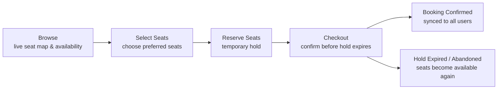
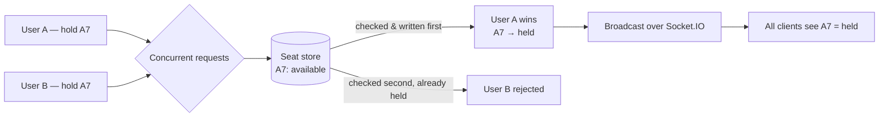
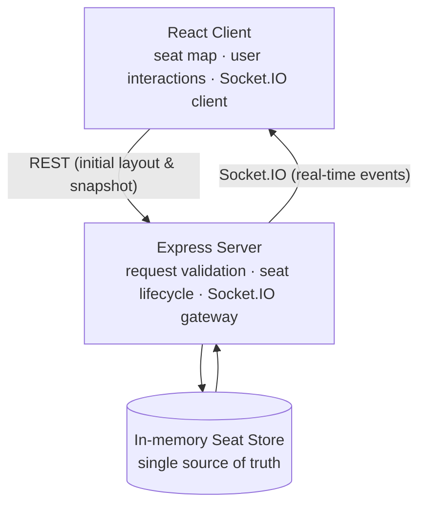

# Concurrent Seat Booking (POC)

A proof-of-concept ticket/seat booking flow (think cinema or event seating) built to explore
one specific hard problem: **keeping seat state correct when many people select the same
seats at the same time, over unreliable connections.**

Real-time seat state is synced across all connected clients over Socket.IO, seat holds expire
automatically, and a client's held seats survive a brief network drop (but not a long one) via
Socket.IO's Connection State Recovery.



## The Race Condition

Two users click seat A5 within the same millisecond. Both requests land on the server almost
back to back.

Whichever one gets the seat, the other must be rejected — cleanly, every time. Not "usually."

**The easy part.** Node's single-threaded event loop means the two requests can never truly
interleave — one handler finishes before the other starts. So the
[hold handler](server/src/store/SeatStore.ts) just has to not give that guarantee away: validate
every seat in the request before writing any of them, with nothing async in between. No locks, no
database transaction. The ordering is free — the discipline of not awaiting mid-write is the
actual job.

**The harder part.** Everything around that instant:

- A seat that's held but never confirmed has to expire on its own.
- A user who vanishes mid-hold (closed tab, dead WiFi, phone locked) can't sit on a seat forever.
- A user with a two-second network blip shouldn't lose their seat over it.

The hold TTLs and disconnect grace period further down exist to handle exactly these.



## Features

- **Live multi-user seat sync** — every hold, confirm, and release is broadcast to all connected
  clients over Socket.IO; the UI never trusts local state, only server events.
- **All-or-nothing seat holds** — selecting multiple seats holds all of them or none, atomically.
- **Two-stage hold expiry** — a soft warning before the hold auto-releases, so a user isn't
  surprised by a seat vanishing with no notice.
- **Seat pricing tiers** — Silver/Gold/Platinum rows, each with its own price, driven off a single
  server-side layout config.
- **Live presence count** — clients see how many other people are currently in the room.
- **Connection-loss handling** — a banner reflects real connection state, and in-flight actions are
  blocked while disconnected instead of silently failing.
- **Connection State Recovery** — a brief network drop reconnects into the same session and the
  user's held seats survive; a longer drop releases them for other buyers. See
  [Demoing Connection State Recovery](#demoing-connection-state-recovery) below.

## Stack

| | |
|---|---|
| **Client** | React 19, TypeScript, Vite, React Router, Tailwind CSS, shadcn/ui, Socket.IO client |
| **Server** | Node.js, Express, TypeScript, Socket.IO, Zod |

## Architecture



The store is in-memory and lives inside the single server process — there's no database and no
horizontal scaling in this POC; every client talks to the same instance.

## How seat locking works

- **Hold** — selecting seats places a hold for 10 minutes, with a warning at the 5-minute mark so
  the UI can nudge the user before it's released.
- **Confirm** — turns a held batch into a booked seat, permanent for this POC (no payment step).
- **Release** — explicit release, or automatic on hold expiry / on the holding socket disconnecting.
- **Disconnect grace period** — a socket that drops isn't treated as gone immediately. The server
  gives it an 8-second window (shortened from Socket.IO's 2-minute default, for demo purposes) to
  reconnect. If it comes back in time, Socket.IO's
  [Connection State Recovery](https://socket.io/docs/v4/connection-state-recovery) resumes the same
  session and the pending release is cancelled — the hold survives a brief blip (a WiFi hiccup, a
  backgrounded tab) without losing the seat. Outside that window, the hold is released for other buyers.
- Every state change is broadcast to all connected clients, and a reconnecting client gets a full
  resync — so the UI stays correct purely off server events, never optimistic local state.

See [server/src/index.ts](server/src/index.ts) and [server/src/store/SeatStore.ts](server/src/store/SeatStore.ts)
for the implementation, and [server/src/constants/seat.ts](server/src/constants/seat.ts) for the seat
map, pricing tiers, and timing values above.

## Demoing Connection State Recovery

In dev builds only, a "Simulate disconnect" panel (bottom-right) lets you force-close the socket
transport and reconnect after an exact delay — a **quick blip (3s)**, inside the recovery window
(hold survives), or a **long drop (12s)**, outside it (hold is released). See
[client/src/components/RecoveryDemoControls.tsx](client/src/components/RecoveryDemoControls.tsx).

## From POC to Production

This POC trades production-scale concerns for a single, clear demonstration of the concurrency
problem. None of these are oversights — they're the boundary of what it set out to prove.

| Current design | Breaks down when | Production approach |
|---|---|---|
| Single Node.js instance | Multiple servers handle the same show | Load balancing + shared coordination |
| In-memory `Map` | The server restarts — all seat state is lost | A persistent datastore |
| One hardcoded seat map | Multiple shows, venues, or sessions exist | State scoped per event/show |
| Socket.IO on one process | Users land on different server instances | Shared real-time infra (e.g. a Redis adapter) |
| No explicit locking — ordering comes from Node's single-threaded event loop | Requests can reach different processes/servers | Distributed coordination (locks/transactions) |
| In-memory timers for hold expiry | Holds must survive a server restart or crash | A durable expiry mechanism (e.g. Redis TTL, a scheduled job) |
| No authentication | Anyone can hold or book any seat | User auth, holds tied to a logged-in user |
| No payment step | Confirm books the seat directly, no charge | A real payment gateway wired into confirm |

## Getting started

`client` and `server` are independent packages, each with their own dependencies — install and run
each from its own directory.

Set up the env files below first, then, in two separate terminals:

```bash
cd server
npm install
npm run dev
```

```bash
cd client
npm install
npm run dev
```

This runs the server (`http://localhost:3000` by default) and the client (`http://localhost:5173`).
Open the client URL in two browser windows to see live seat sync between "users."

### Environment variables

**`server/.env`**

```bash
PORT=3000
CLIENT_ORIGIN=http://localhost:5173
```

| Variable | Purpose |
|---|---|
| `PORT` | Port the Express/Socket.IO server listens on |
| `CLIENT_ORIGIN` | Exact origin allowed by CORS for both REST and the socket handshake |

**`client/.env`**

```bash
VITE_SERVER_URL=http://localhost:3000
```

| Variable | Purpose |
|---|---|
| `VITE_SERVER_URL` | Backend base URL the client calls (REST + socket) |

## Project structure

```
client/   React SPA — seat grid, checkout, socket state provider
server/   Express + Socket.IO — seat store, hold/confirm/release handlers, REST endpoints
```
